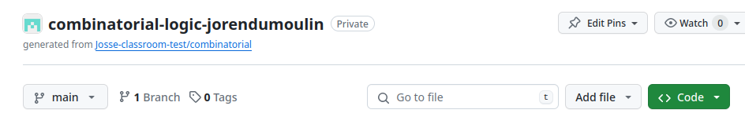
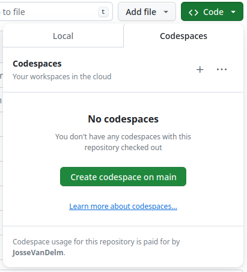
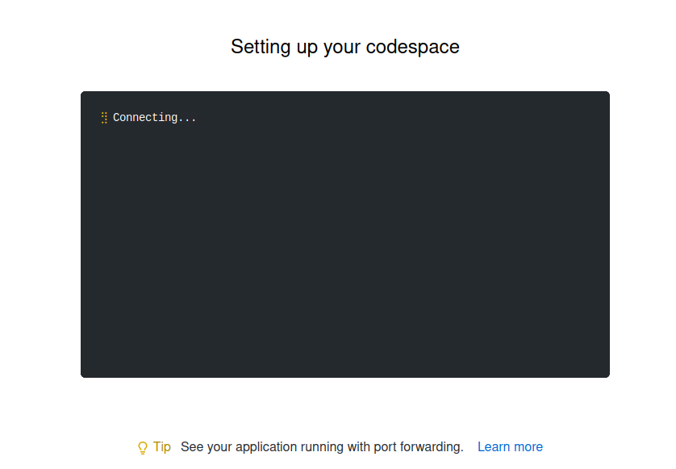
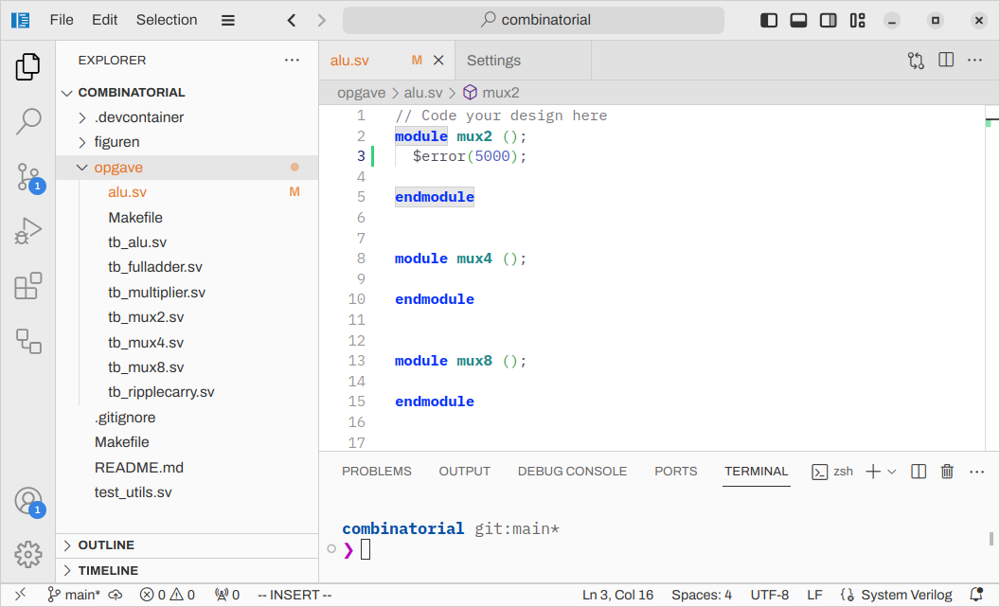
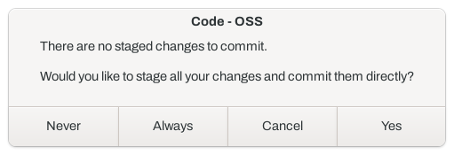

# Voorwoord

In deze oefenzitting gebruiken we Visual Studio Code om code te bewerken
via GitHub codespaces in de browser.

## Github Codespace opstarten

* Klik op de `code` sectie in de titelbalk van je repository.



* Ga naar de codespace tab in de popup. Klik op `create codespace on main`.



* Er verschijnt nu een venster waarin de codespace wordt opgestart.



* Nu heb je toegang tot VS Code in de browser!

## Basisgebruik Git in VS Code

**Let op! Aanpassingen in je Github Codespace worden niet automatisch doorgestuurd naar je github repository,
daarvoor moet je steeds `sync` (stap 4) doen!**

Hierbij leggen we kort uit hoe je git kan gebruiken in VS code.
Git is een versiecontrolesysteem, wat je toelaat om verschillende versies van code op te slaan, vergelijken en aanpassen.
In dit labo gebruiken we een simpele flow waarbij we enkel commits maken op de `main` branch.

1) Maak een aanpassing in een bestand.
In de goot van de editor verschijnt er nu een groene lijn om aan te duiden dat er iets wordt toegevoegd.


2) Ga naar het versiecontrolepaneel in VS Code.
Je ziet nu dat er een aanpassing is gemaakt in `alu.sv`.
Voeg een korte commit-message toe waarin je zegt wat je doet in beknopte imperatieve verwoording.


3) Druk nu op commit, er verschijnt een popup venster dat zegt dat niet alle files zijn gestaged.
Druk op ja, om alle aangepaste bestanden te stagen en te committen.


4) Nu bestaat er een nieuwe checkpoint van de code in je repository in je codespace,
maar nog niet op je github repository die nagekeken wordt door de assistenten.
Om de veranderingen door te sturen naar de github repository, druk je op `publish branch`/`sync`.


# Oefenzitting Verilog: Ontwerp van een ALU

In deze eerste computerzitting ontwerp je een _Arithmetic and Logic Unit (ALU)_,
om die te gebruiken voor een _Finite Impulse Response (FIR-)filter_ in latere zittingen van dit vak.
De ALU moet 8 instructies kunnen uitvoeren die in de tabel hieronder staan.
De ruwe structuur van de ALU is weergegeven in figuur 1.

| ALU | Control Functie |
|-----|-----------------|
| 000 |     A + B       |
| 001 |     A * B       |
| 010 |     A – B       |
| 011 |     B – A       |
| 100 |     A << 1      |
| 101 |     A XOR B     |
| 110 |     A AND B     |
| 111 |     A OR B      |


_Figuur 1: Hoog-niveau architectuur ALU_

## Werkwijze

De bedoeling is om zo modulair mogelijk te werk te gaan.
Om daarmee te helpen is er een template ter beschikking gesteld in de `opgave`-map

Deze template bestaat uit de volgende componenten:

```
opgave
├── alu.sv            : bevat alle componenten van de alu
├── Makefile          : build-instructies om de simulatie te compileren
├── tb_alu.sv         : testbench voor alu component gedefinieerd in alu.sv
├── tb_fulladder.sv   : testbench voor fulladder component definieerd in alu.sv
├── tb_multiplier.sv
├── tb_mux2.sv
├── tb_mux4.sv
├── tb_mux8.sv
└── tb_ripplecarry.sv
```

In deze oefenzitting maken we gebruik van de `verilator` simulator.
We gebruiken `make` om de simulator aan te sturen.

Hier is een kort overzicht van welke commando's ondersteund zijn in de volgende oefeningen.
Deze commando's werken enkel in de `opgave`-map.

Om in de terminal naar een andere map te gaan, bv.`opgave` gebruik je `cd` (**c**hange **d**irectory).
```sh
cd opgave # Ga de opgave folder in
cd ..     # Ga terug naar de bovenliggende folder
```

Om de simulatie van `tb_mux2.sv` te draaien, voer het volgende `make` commando uit:
```sh
make simulate_tb_mux2
```


## Ontwerp

### 2:1 Multiplexer

Vooraleer we de ALU kunnen implementeren,
moeten we enkele basisonderdelen maken die we later kunnen gebruiken.
Een 2:1 multiplexer is een noodzakelijke simpele component.
Laten we eens proberen om deze te simuleren:
```sh
$ make simulate_tb_mux2
```
Oei! Dat werkt niet!:
```
verilator --binary --timing --trace --assert -j 0 -Wno-MULTITOP tb_alu.sv
%Error-PINNOTFOUND: tb_alu.sv:14:18: Pin not found: 'A'
   14 |    alu #(8) dut(.A(A), .B(B), .ctrl(ctrl), .y(y));
      |                  ^
                    ... For error description see https://verilator.org/warn/PINNOTFOUND?v=5.020
%Error-PINNOTFOUND: tb_alu.sv:14:25: Pin not found: 'B'
   14 |    alu #(8) dut(.A(A), .B(B), .ctrl(ctrl), .y(y));
      |                         ^
%Error-PINNOTFOUND: tb_alu.sv:14:32: Pin not found: 'ctrl'
   14 |    alu #(8) dut(.A(A), .B(B), .ctrl(ctrl), .y(y));
      |                                ^~~~
%Error-PINNOTFOUND: tb_alu.sv:14:45: Pin not found: 'y'
   14 |    alu #(8) dut(.A(A), .B(B), .ctrl(ctrl), .y(y));
      |                                             ^
%Error-PINNOTFOUND: tb_alu.sv:14:10: Parameter not found: '__paramNumber1'
   14 |    alu #(8) dut(.A(A), .B(B), .ctrl(ctrl), .y(y));
      |          ^
%Error: Exiting due to 5 error(s)
        ... See the manual at https://verilator.org/verilator_doc.html for more assistance.
make: *** [../Makefile:45: obj_dir/Vtb_alu] Error 1
```
Dit is natuurlijk omdat de `mux2`-component in `tb_mux2` nog niet gedefinieerd is in alu.sv,
laten we die dus eerst maken!

1) **In `alu.sv`, definieer de in- en uitgangen in Verilog en geef ze een duidelijke naam**

2) **Implementeer nu de functionaliteit van een 2:1-MUX met een conditionele toekenning**

We hebben nu nog enkel maar componenten ontworpen die met signalen van 1 bit werken. Een
ALU werkt met meerdere bits, dus de multiplexers moeten aangepast worden zodat deze
met meerdere bits werken. Hiervoor kan je vectoren gebruiken.

3) **Pas de 2:1-MUX aan zodat de twee ingangen en de uitgang bestaan uit 4 bits.**

4) **Als je nu eenvoudig het aantal bits wil aanpassen zal je een parameter nodig hebben voor het aantal bits.
   Zorg nu dat het aantal bits van de multiplexer afhangt van parameter N.**

5) **Test de component nu en controleer of de golfvormen overeenkomen met wat je verwacht.
   Gebruik hiervoor het commando**:
   ```sh
   make simulate_tb_mux2
   ```
   Dit maakt de testbench aan die voorzien is en legt enkele teststimuli aan.
   * Check in de Wave viewer of de uitgangen kloppen.
   Doe dit door te dubbelklikken op het bestand `waveform_tb_mux2.vcd`.
   Dit opent de wave viewer.
   Voeg de belangrijkste signalen toe en kijk na of het gedrag is wat je verwacht.
   Je kan tot 8 signalen toevoegen.

   * Kijk in de terminal of alle testen correct zijn, ga pas door naar de volgende oefening als alle testen juist zijn.

### 4:1 Multiplexer

Op het schema kan je ook zien dat we een 4:1-multiplexer nodig hebben.
Deze is echter eenvoudig te maken met 2:1-multiplexers, zoals werd gezien in het hoorcollege.

1) **Definieer de in- en uitgangen in `alu.sv` en geef ze een duidelijke naam**

2) **Implementeer nu hiërarchisch de 4:1-MUX door de module uit 2:1 te gebruiken**

3) **Test je component uitgebreid na elke stap met de voorziene testbench in `tb_mux4.sv`**

4) **Maak nu op dezelfde manier een 8:1-MUX door gebruik te maken van zowel de 2:1-MUX als de 4:1-MUX**

5) **Test je component uitgebreid na elke stap met de voorziene testbench in `tb_mux8.sv`**

6) **Test nu de 8:1-MUX voor parameter N = 6-bit in- en uitgangen.**

### Adder

Zoals gezien in het hoorcollege is de optelling al geïmplementeerd in Verilog.
Je kan dus in principe simpelweg de `+`-operator gebruiken.
In deze oefening kiezen we er echter voor om dat niet te doen, maar maken we een ripple carry adder.
Deze bestaat uit enkele full adders.

1) **Definieer de in- en uitgangen van de fulladder, zodat deze overeenkomen met `tb_fulladder.sv`.
    Gebruik opnieuw een parameter voor het aantal bits.**

2) **Implementeer de full adder en test het met `tb_fulladder.sv`.**

3) **Definieer de in- en uitgangen van de volledige ripplecarry adder, zodat deze overeenkomen met tb_ripplecarry.
    Gebruik de full adders gedefinieerd in de vorige oefening en gebruik terug een parameter voor het aantal bits.
    Voeg ook zeker een carry-in en carry-out toe.**

4) **Implementeer de ripplecarry adder in dit blok en test het tot `tb_ripplecarry` geen fouten meer geeft.**

### Adder-subtractor

Een aftrekking voeren we uit door eerst een van de getallen te inverteren en dan op te tellen.
Bij de optelling zetten we dan de carry-in op 1 want `A – B = A + B’ + 1`, zoals gezien in het hoorcollege.
Er is dus geen extra hardware nodig buiten een adder en inverter.

### Multiplier

In Verilog kan je ook simpelweg een rekenkundige operatie gebruiken om een vermenigvuldiging te implementeren.
Dit leidt echter niet altijd tot de beste oplossing.
Een bijkomend probleem is dat als we 2 N-bit getallen willen vermenigvuldigen, we een 2N-bit uitgang nodig hebben.
Voor deze ALU gaan we voorlopig simpelweg de N LSB’s weglaten en enkel de N MSB’s naar de uitgang sturen.
(In oefenzitting 5 zal dit later nog aangepast worden.)

1) **Definieer de in- en uitgangen**

2) **Maak een extra wire aan om het volledige resultaat bij te houden**

3) **Implementeer de multiplier door `*` te gebruiken**

4) **Maak ten slotte de uitgang gelijk aan de MSB’s van het tussenresultaat**

5) **Test de multiplier met `tb_multiplier.sv`**

### ALU

1) **Definieer de in- en uitgangen van de ALU, en zorg dat deze overeenkomen met de signalen in `tb_alu.sv`.**

2) **Gebruik de standaard operaties van Verilog om de logische bewerkingen te implementeren.**

3) **Voeg ten slotte alles samen zoals in het schema van Figuur 1.**

### Test de volledige ALU:

Teststimuli bestaan uit toekenning van een of meerdere variabelen en een bepaalde delay,
zodat er tijd is om de uitgangen te bekomen.

1) **Test de ALU met de gegeven tests in `tb_alu.sv`.**

2) **Kijk in de terminal na of je blok zich juist gedraagt in alle mogelijke scenario’s.**

revision:
d7da724e6e8c5008a1ae81a6fd2b565363128649
